# Прогнозирование продаж (Intermittent)

**Данные**
Имеются данные о продажах двух товарных номенклатур интернет-магазина. Каждая строчка в файле содержит дату и количество номенклатур, купленных в этот день. Обе номенклатуры резко отличаются частотой реализиции.

**Задача:** Требуется найти модель, способную прогнозировать обе номенклатуры с приемлемой точностью на 30-40 дней вперёд. 

**Метрики:** Клиент оценивает качество прогнозирования по метрике buying score. Перезакуп buying score > 1 более вреден, чем недозакуп buying score < 1.  

Решение поставленной задачи выполнялось в три основных этапа:
1. Анализ исходных данных.
2. Анализ существующих методов решения. Поиск наиболее оптимального и эффективного
3. Выполнение поставленной задачи, используя выбранный метод.

## Этап 1. Анализ исходных данных

Первым этапом был проведен анализ исходных данных. В результате анализа было выявлено, что:
1. Исходные данные в таблице расположены не в хронологическом порядке. Было принято решение отсортировать исходный ряд в хронологическом порядке.
2. Некоторые даты в списке повторялись дважды (18 строк). При изучении повторяющихся данных можно было предположить два варианта:

     а) Это случайные дубликаты, которые необходимо удалить;

     б) В данный день было сделано несколько продаж, но в разное время, а из-за возможной специфики БД эти продажи расположились на разных строках.

      В результате было принято решение опираться на вариант _б_. Поэтому была создана дополнительная функция _"_delete_duplicte" _. Данная функция автоматически проверяет набор данных и извлекает дублирующиеся строки, затем суммирует их значения, и удалет лишиние данные. 
3. В представленных данных присутствуют относительно большие хронологические разрывы. Это говорит о том, что в пропущенные дни не было продаж. Использование этих дополнительных вводных дает модели и человеку больше полезной информации при выполнении задачи прогнозирования спроса\числа продаж. Было принято решение добавить в набор данных пропущенные даты и присвоить значение продаж, равное нулю.

В результате применения всех преобразований было выявлено, что данная задача представляет собой ничто иное, как прогнозирование прерывистого и "комковатого" временного ряда (Intermittent and Lumpy Time Series Forecasting).

## Этап 2. Анализ методов
В первую очередь с поомощью библиотеки statsforecast компании [Nixtla] (https://nixtla.github.io/statsforecast/) были проверены основные [алгоритмы]( https://nixtla.github.io/statsforecast/docs/tutorials/intermittentdata.html) , использующиеся для решения подобной задачи:

✅ ADIDA				✅ CrostonClassic			✅ CrostonOptimized			✅ CrostonSBA			✅ IMAPA		✅ TSB

Анализ данных алгоритмов показал, что несмотря на высокую эффективность, данные алгоритмы не подходят для финального решения данной задачи, так как способны выполнять только точечные предсказания, а в нашем случае необходимо  выполнять предсказания на 30-40 дней вперерд

Вторым этапом проверялись динамические модели, такие как:

✅ Модель Хольта-Винтерса ✅Модель SARIMA ✅Модель fbProphet

Полученный результат так же не показал достаточной точности. 

Третьим этапом было принято решение провести анализ алгоритмов машинного обучения. В результате анализа [статьи](https://d-nb.info/1251326714/34) было выявлено, что использование алгоритмов машинного обучения, таких как ✅ Random Forest ✅XGBoost ✅Auto-SVR может принести положительный эффект. однако есть более точные решения.

Заключительным этапом собирались и проверялись различные модели и комбинации  моделей нейронных сетей, таких как: ✅ LSTM, ✅ SimpleRNN. В результате анализа было выявлено, что наиболее эффективным решением данной задачи является построение модели нейронной сети.

## Этап 3. Выполнение поставленной задачи

Для наглядности выполнения задачи был использован формат представления данных в виде .ipynb Jupyter ноутбука. Таким образом можно более наглядно продемонстрировать все этапы выполнения поставленной задачи. 

Разработанный алгоритм, решающий поставленную задачу, представляет собой ансамбль моделей НС:

1. Модель 1 **файл Yes_No_Model.ipynb** направлена на выполнение своего рода бинарной классификации, и с определенной долей вероятности определяет, будет ли в данный день продажа или нет. Для решения поставленной задачи была выбрана модель байесовской сверточной нейронной сети ([Bayesian Convolutional Neural Network Model](https://pdfs.semanticscholar.org/5033/8309562df658011182b9cbaba6fb0677b57b.pdf)). Архитектура модели представлена на рисунке 1:

Рисунок 1. Архитектура первой модели

Для обучения данной модели был подготовлен новый набор данных, представляющий собой трансформированный исходный набор данных, в котором каждый день продажи, независимо от числа продаж, был помечен 1, а все пустые дни - 0. Модель обучалась 100 эпох на домашней системе с видеокартой GTX970 и объемом RAM 16 gb (рисунок 2). 

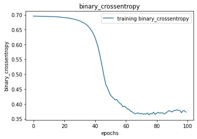

Рисунок 2. Обучение модели

Тестирование модели производилось как для высокочастотной номенклуатуры (на тестовом наборе данных) (рисунок 3), так и для низкочастотной номенклуатуры (рисунок 4). При прогнозировании продаж для высокочастотной номенклуатуры на несколько дней вперед **перезакуп составил 5 штук** (на пять дней, в которые должны быть продажи, предсказано больше, чем есть на самом деле). **Показатель buying_score = 1.0845 и близок  к еденице**. 

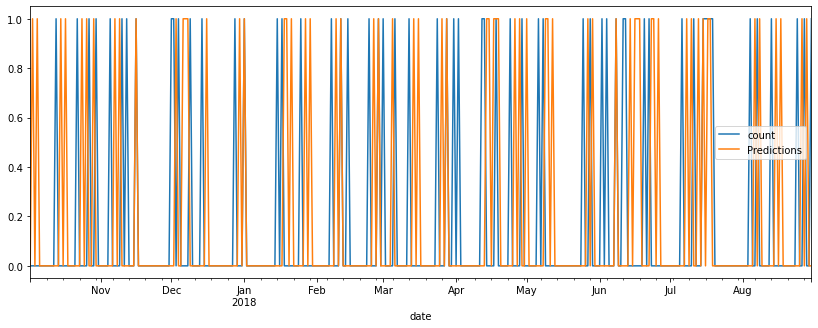

Рисунок 3. Результат работы алгоритма для высокочастотной номенклуатуры

При прогнозировании продаж для низкочастотной номенклуатуры на несколько дней вперед **перезакуп составил 10 штук** (на десять дней, в которые должны быть продажи, предсказано больше, чем есть на самом деле). Показатель **buying_score = 1.0361**. При этом **отношение числа закупленного к числу продаж составл 1.66**, что все еще далеко от идеала, однако стоит учесть, что прогннозирование выполнялось по все набору данных (больше года). 

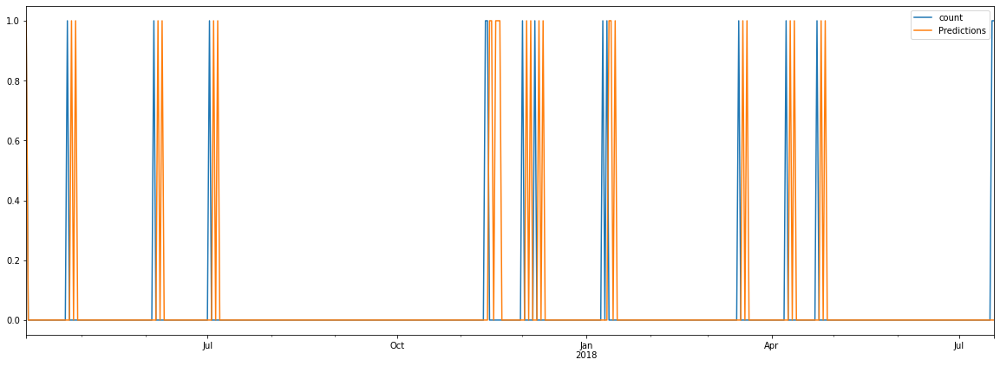
Рисунок 4. Результат работы алгоритма для низкочастотной номенклуатуры

2. Модель 2 **файл Sells Model.ipynb** направлена на предсказание числа продаж в тот или иной день. Данная модель исключает все дни, когда нет продаж и основывется только на тех днях, когда они были. Представляет собой классическую LSTM модель. Архитектура модели представлена на рисунке 5.
  

Рисунок 5. Архитектура второй модели
  
  
Модель обучалась 1000 эпох (Рисунок 6). Для обучения данной модели был подготовлен новый набор данных, представляющий собой исходный набор данных, в котором все даты отсортированы в хронологическом порядке.

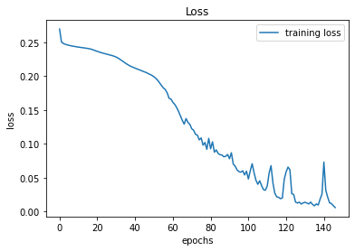

Рисунок 6. Обучение модели

Тестирование модели производилось как для высокочастотной номенклуатуры (на тестовом наборе данных) (рисунок 7), так и для низкочастотной номенклуатуры (рисунок 8). При прогнозировании продаж для высокочастотной номенклуатуры на несколько дней вперед **нелозакуп составил 1 штуку** . **Показатель buying_score = 1.044 и близок  к еденице**. **Отношение числа закупленных товаров к числу продаж составило 0.9808**

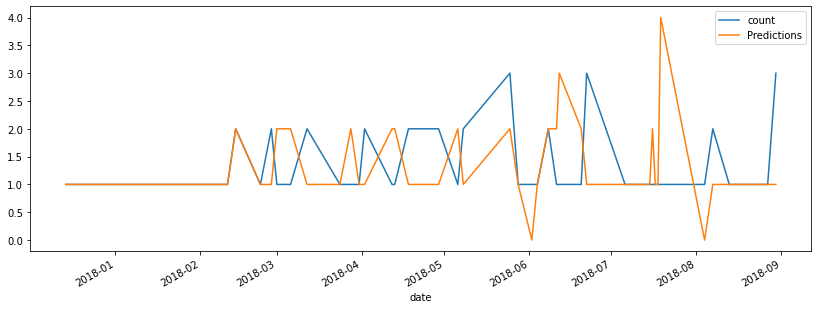

Рисунок 7. Результат работы алгоритма для высокочастотной номенклуатуры

При прогнозировании продаж для низкочастотной номенклуатуры на несколько дней вперед **перезакуп составил 0 штук** . Показатель **buying_score = 0.0**. При этом **отношение числа закупленного к числу продаж составл 1.0**, что в какой-то мере идеально. 

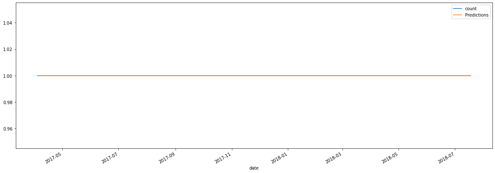
Рисунок 8. Результат работы алгоритма для низкочастотной номенклуатуры

Дополнительно был проведен экперимент по прогнозированию числа продаж на 40 дней вперед. Результат для высокочастотной номенклуатуры представлен на рисунке 9, а дли низкочастотной - на риснуке 10.

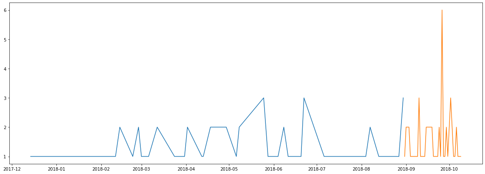
Рисунок 9. Результат работы алгоритма при предсказании числа продаж на месяц вперед для высокочастной номенклуатуры

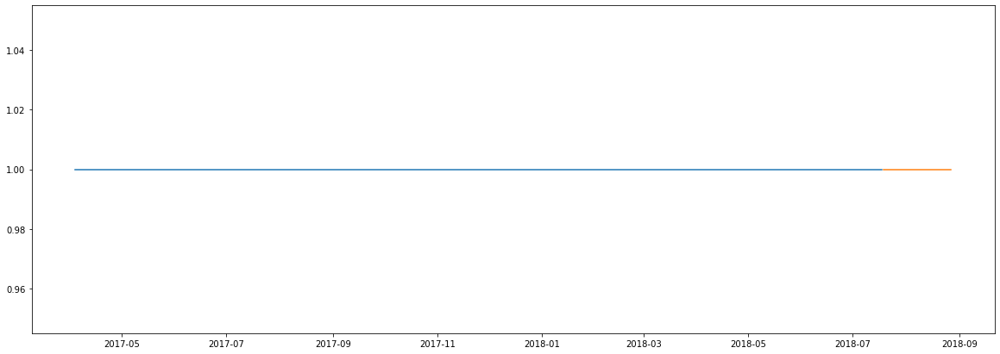
Рисунок 10. Результат работы алгоритма при предсказании числа продаж на месяц вперед для низкочастотной номенклуатуры

3. Заключительным этапом разработанные модели объединялись в единый ансамбль, представленный в файле **Intermittent forecasting.ipynb**
На вход алгоритму подается батч, состоящий из 10 временных промежутков (дней). В цикле первая модель, на основе полученного батча, определяет, должна ли быть в этот день продажа. Затем вторая модель (если первая модель определила, что в этот день должна быть продажа), на основе все того же батча, определяет, сколько едениц товара может быть продано.

Было проведено несколько экспериментов.

В первом эксперименте алгоритм работал с тестовым набором данных (343 дня) высокочастотной номенклуатауры. В результате **перезакуп составил 28 едениц (112 из 84)**.
Во втором эксперименте алгоритм работал с полным набором данных (>1000 дней) высокочастотной номенклуатауры. В результате **перезакуп составил 81 еденица (309 из 228)**.
В третьем эксперименте алгоритм работал с полным набором данных (>1000 дней) высокочастотной номенклуатауры. Но проверка осуществлялась только последних **40** дней. В результате **недозакуп составил 2 еденицы товара (7 из 9)**.
В четвертом эксперименте было выполнено предсказание высокочастотной нуменклуатуры на 40 дней вперед. Результат представлен на рисунке 11:

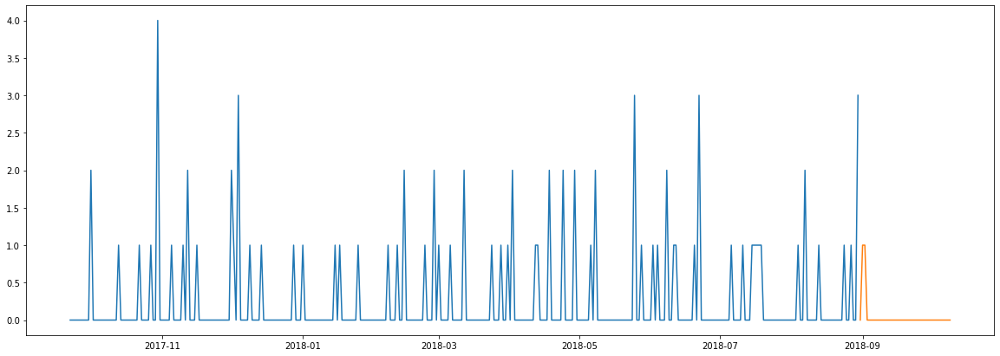
Рисунок 10. Результат работы алгоритма при предсказании числа продаж на 40 дней вперед для высокочастотной номенклуатуры

В пятом эксперименте алгоритм работал с полным набором данных (>400 дней) низкочастотной номенклуатауры. В результате **перезакуп составил 10 едениц (10 из 15)**.
В четвертом эксперименте было выполнено предсказание высокочастотной нуменклуатуры на 40 дней вперед. Результат представлен на рисунке 11:

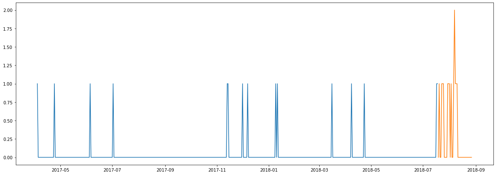
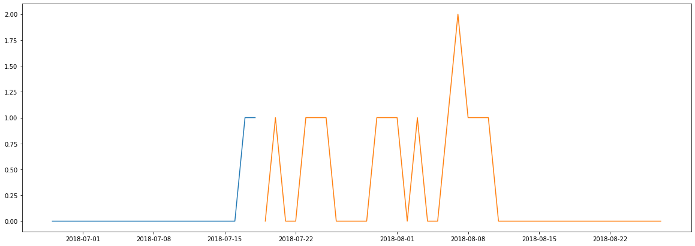
Рисунок 11. Результат работы алгоритма при предсказании числа продаж на 40 дней вперед для высокочастотной номенклуатуры

Как видно из приведенных экспериментов разработанная модель все еще не обладает достаточной точностью и существуют значительные перевесы как в одну сторону, так и в другую. Однако дальнейшие исследования в данной области позволят увеличить итоговый показатель точности.

Для более детального изучения разработанных моделей в репозитории приложены соответствующие ноутбуки.

## Этап X. Альтернативное решение данной

Задача прогнозирования прерывистого временного ряда является достаточно трудозатратной, и до сих пор идеально не решенной. Альтернативой ранее предложеному методу служит способ, при котором мы заранее группируем имеющиеся данные в большие временные промежутки (например, недели, месяца или кварталы). Подобное преобразование позволит исключить ненужные прерывания во временных рядах, что в значительной степени упростит задачу. В конечном итоге спрогнозированный результат мы распределяем на то количнество дней, масштаб которого мы использовали для преобразования временного ряда (месяц - делим на 30 дней, неделя - 7 дней, квартал - 90 и так далее).

Дополнительно к основному решению  **в папке X** приложены два ноутбука, отображающие решение при масштабировании по месяцам и неделям соотвественно.
